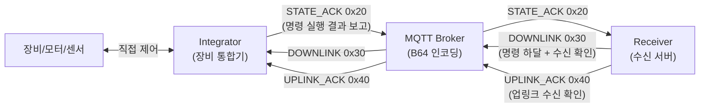
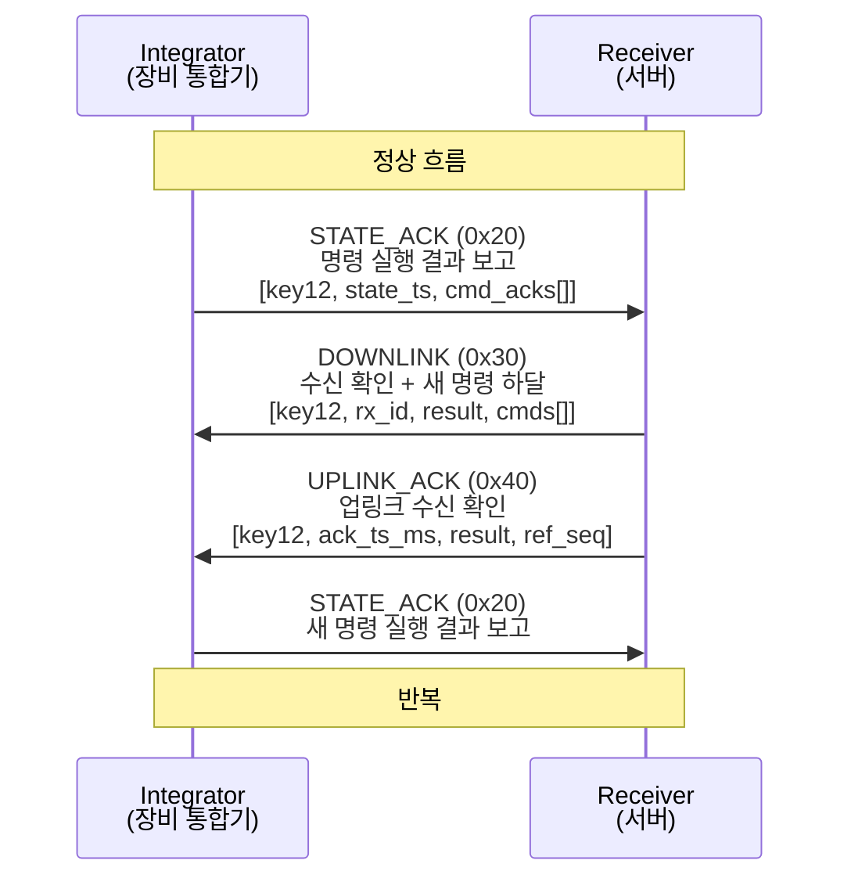
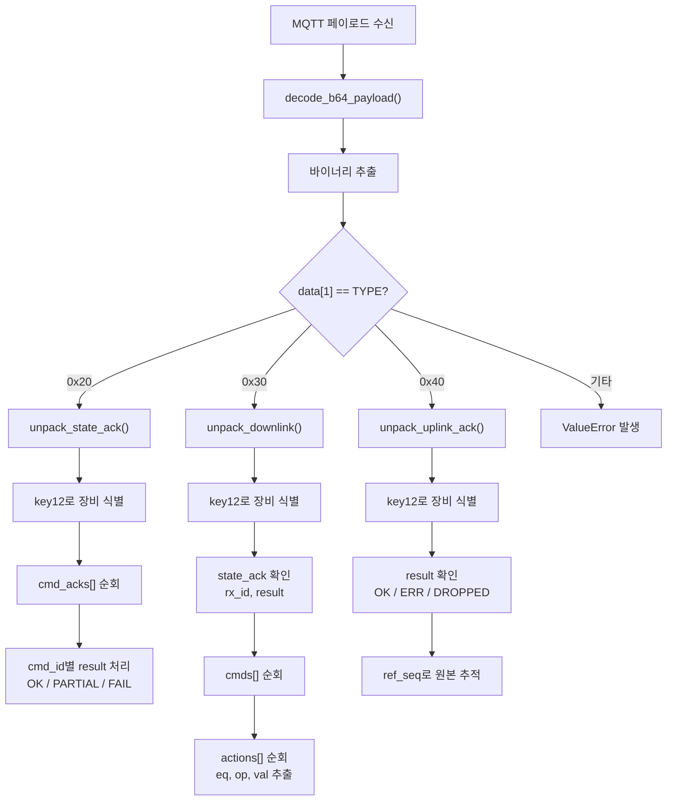

# binary_protocol.py 기반 프로토콜 정의서 초안

> **소스 파일:** `protocol/binary_protocol.py`  
> **프로토콜 버전:** `0x01`  
> **최종 작성일:** 2026-04-20  
> **상태:** 초안 (Draft)

---

## 1. 프로토콜 한줄 요약

**Integrator(장비 통합기)와 Receiver(수신 서버) 간 MQTT/Base64를 통한 바이너리 명령·응답 프로토콜 코덱**

- 바이너리 기반, Little-endian
- 패킷 3종: STATE_ACK(`0x20`), DOWNLINK(`0x30`), UPLINK_ACK(`0x40`)
- 체크섬/CRC 없음 — 무결성 검증은 하위 전송 계층(MQTT/TLS)에 의존
- MQTT 전송 시 `B64:` 접두사 Base64 인코딩 사용

---

## 2. 시스템 구성도



### 역할 정의

| 구성 요소 | 역할 |
|----------|------|
| **장비/모터/센서** | 실제 물리 장치. Integrator가 직접 제어 |
| **Integrator** | 장비와 직접 통신하며, 서버 명령을 실행하고 결과를 보고 |
| **MQTT Broker** | 전송 매체. 바이너리를 Base64로 인코딩하여 전달 |
| **Receiver** | 서버 측 수신 모듈. 명령 하달 및 상태 수집 |

---

## 3. 통신 시퀀스



### 패킷 방향 요약

| 패킷 타입 | 코드 | 방향 | 성격 |
|----------|------|------|------|
| STATE_ACK | `0x20` | Integrator → Receiver | 응답/보고 (명령 실행 결과) |
| DOWNLINK | `0x30` | Receiver → Integrator | 명령/제어 (명령 하달 + 상태 수신 확인) |
| UPLINK_ACK | `0x40` | Receiver → Integrator | 확인 (업링크 수신 확인) |

---

## 4. 전체 패킷 구조

### 4.1 공통 특성

| 항목 | 내용 |
|------|------|
| STX / ETX / Magic Number | 없음 |
| 전체 길이 필드 | 없음 (타입별 파싱 로직에 의존) |
| 패킷 길이 유형 | **가변 길이** (STATE_ACK, DOWNLINK) / **고정 24B** (UPLINK_ACK) |
| 체크섬 / CRC | 없음 |
| 엔디안 | Little-endian (`<H`, `<I`) |
| 문자열 | Length-prefixed ASCII `[1B 길이][NB 문자열]` |
| KEY12 | 12바이트 고정 길이 ASCII (len-prefix 없음, 유일한 예외) |

### 4.2 공통 헤더 (2 바이트)

모든 패킷은 아래 2바이트 헤더로 시작한다. TYPE 값으로 패킷 종류를 판별한다.

```
Offset  0         1
        +---------+---------+
        |   VER   |  TYPE   |
        |  (1B)   |  (1B)   |
        | 0x01 고정| 0x20/30/40|
        +---------+---------+
```

### 4.3 STATE_ACK 바이트 레이아웃 (TYPE = 0x20)

```
 ┌─────────────────── 고정 헤더 (19 바이트) ───────────────────┐
 │                                                              │
 │  Offset: 0     1     2 ··············· 13   14 ······ 17  18 │
 │        +-----+------+------------------+-----------+-----+  │
 │        | VER | TYPE |     KEY12        | STATE_TS  |  N  |  │
 │        | 1B  |  1B  |     12B          |  4B (LE)  | 1B  |  │
 │        |0x01 | 0x20 | ASCII 고정길이   | uint32    |     |  │
 │        +-----+------+------------------+-----------+-----+  │
 └──────────────────────────────────────────────────────────────┘

 ┌───────────────── cmd_ack 반복 블록 (× N회) ─────────────────┐
 │                                                              │
 │  +----------+--------+-----------+------------+-----------+  │
 │  |  cmd_id  | result |  ack_ts   | detail_len |  detail   |  │
 │  | LP str*  |  1B    |  4B (LE)  |  2B (LE)   |  가변     |  │
 │  | 가변     | enum   |  uint32   |  uint16    | UTF-8 JSON|  │
 │  +----------+--------+-----------+------------+-----------+  │
 │                                                              │
 │  * LP str = Length-Prefixed String [1B len][NB ASCII]        │
 └──────────────────────────────────────────────────────────────┘
```

- **최소 패킷 길이:** 19바이트 (N=0일 때)
- **최대 cmd_ack 수:** 255개 (uint8)

### 4.4 DOWNLINK 바이트 레이아웃 (TYPE = 0x30)

```
 ┌──────────────── 헤더 영역 (가변) ────────────────────────────┐
 │                                                              │
 │  Offset: 0     1     2 ········· 13    14                    │
 │        +-----+------+------------+----------+                │
 │        | VER | TYPE |   KEY12    |  rx_id   |                │
 │        | 1B  |  1B  |   12B      | LP str*  |                │
 │        |0x01 | 0x30 | ASCII 고정 |  가변    |                │
 │        +-----+------+------------+----------+                │
 │                                                              │
 │        +-------------+--------+---------+                    │
 │        | RECEIVED_AT | RESULT | N_CMDS  |                    │
 │        |  4B (LE)    |  1B    |  1B     |                    │
 │        |  uint32     |  enum  |         |                    │
 │        +-------------+--------+---------+                    │
 └──────────────────────────────────────────────────────────────┘

 ┌──────────────── cmd 반복 블록 (× N_CMDS회) ─────────────────┐
 │                                                              │
 │  +----------+-----------+-----------+                        │
 │  |  cmd_id  |  ttl_sec  | n_actions |                        │
 │  | LP str*  |  2B (LE)  |    1B     |                        │
 │  |  가변    |  uint16   |           |                        │
 │  +----------+-----------+-----------+                        │
 │                                                              │
 │  ┌──────── action 반복 블록 (× n_actions회, 7B 고정) ─────┐ │
 │  │                                                         │ │
 │  │  +------+------+-------+                                │ │
 │  │  |  eq  |  op  |  val  |                                │ │
 │  │  |  4B  |  1B  | 2B LE |                                │ │
 │  │  |ASCII | enum | uint16|                                │ │
 │  │  +------+------+-------+                                │ │
 │  └─────────────────────────────────────────────────────────┘ │
 └──────────────────────────────────────────────────────────────┘
```

- **최소 패킷 길이:** 15바이트 (코드상 검증 기준)
- **action은 고정 7바이트:** eq(4) + op(1) + val(2)

### 4.5 UPLINK_ACK 바이트 레이아웃 (TYPE = 0x40)

```
 ┌──────────────── 고정 길이 패킷 (24 바이트) ──────────────────┐
 │                                                              │
 │  Offset: 0     1     2 ········· 13   14 ···· 17  18  19    │
 │        +-----+------+------------+-----------+----+----+     │
 │        | VER | TYPE |   KEY12    | ACK_TS_MS |RES |FLG |     │
 │        | 1B  |  1B  |   12B      |  4B (LE)  | 1B | 1B |     │
 │        |0x01 | 0x40 | ASCII 고정 |  uint32   |enum|    |     │
 │        +-----+------+------------+-----------+----+----+     │
 │                                                              │
 │  Offset: 20 ········· 23                                     │
 │        +----------------+                                    │
 │        |    REF_SEQ     |                                    │
 │        |    4B (LE)     |                                    │
 │        |    uint32      |                                    │
 │        +----------------+                                    │
 └──────────────────────────────────────────────────────────────┘
```

- **고정 24바이트** — 가변 필드 없음

---

## 5. 필드 상세 정의

### 5.1 STATE_ACK 필드 (TYPE = 0x20)

#### 고정 헤더 (19 바이트)

| 순서 | 필드명 | 바이트 길이 | 자료형 | 엔디안 | 의미 | 가능한 값 | 비고 |
|:----:|--------|:----------:|--------|:------:|------|-----------|------|
| 1 | VER | 1 | uint8 | — | 프로토콜 버전 | `0x01` | 고정값 |
| 2 | TYPE | 1 | uint8 | — | 패킷 타입 | `0x20` | STATE_ACK 고정 |
| 3 | **KEY12** | 12 | ASCII[12] | — | **장비 식별자** | 12자 ASCII | 고정 길이, len-prefix 없음 |
| 4 | STATE_TS | 4 | uint32 | LE | 상태 타임스탬프 | Unix epoch (초) | `& 0xFFFFFFFF` 마스킹 |
| 5 | N | 1 | uint8 | — | cmd_ack 항목 수 | 0 ~ 255 | |

#### 반복 블록: cmd_ack (N회)

| 순서 | 필드명 | 바이트 길이 | 자료형 | 엔디안 | 의미 | 가능한 값 | 비고 |
|:----:|--------|:----------:|--------|:------:|------|-----------|------|
| 6 | cmd_id | 가변 | LP str | — | **명령 ID** | ASCII 문자열 | `[1B len][NB str]` |
| 7 | **result** | 1 | uint8 | — | **실행 결과 코드** | `0x00`=OK, `0x01`=PARTIAL, `0x02`=FAIL | enum |
| 8 | ack_ts | 4 | uint32 | LE | 응답 타임스탬프 | Unix epoch (초) | 명령 처리 완료 시각 |
| 9 | detail_len | 2 | uint16 | LE | detail JSON 길이 | 0 ~ 65535 | 바이트 단위 |
| 10 | detail | 가변 | bytes | — | 상세 결과 데이터 | UTF-8 JSON 배열 | opaque, 최대 64KB |

### 5.2 DOWNLINK 필드 (TYPE = 0x30)

#### 헤더 영역 (가변)

| 순서 | 필드명 | 바이트 길이 | 자료형 | 엔디안 | 의미 | 가능한 값 | 비고 |
|:----:|--------|:----------:|--------|:------:|------|-----------|------|
| 1 | VER | 1 | uint8 | — | 프로토콜 버전 | `0x01` | 고정값 |
| 2 | TYPE | 1 | uint8 | — | 패킷 타입 | `0x30` | DOWNLINK 고정 |
| 3 | **KEY12** | 12 | ASCII[12] | — | **장비 식별자** | 12자 ASCII | 고정 길이 |
| 4 | **rx_id** | 가변 | LP str | — | **수신 참조 ID** | 예: `"sha1:abcd1234..."` | 이전 상태보고의 참조값 |
| 5 | RECEIVED_AT | 4 | uint32 | LE | 수신 타임스탬프 | Unix epoch (초) | 서버가 상태를 수신한 시각 |
| 6 | **RESULT** | 1 | uint8 | — | **상태 수신 결과** | `0x00`=OK, `0x01`=ERR | 이전 STATE 수신 성공/실패 |
| 7 | N_CMDS | 1 | uint8 | — | 명령 개수 | 0 ~ 255 | |

#### 반복 블록: cmd (N_CMDS회)

| 순서 | 필드명 | 바이트 길이 | 자료형 | 엔디안 | 의미 | 가능한 값 | 비고 |
|:----:|--------|:----------:|--------|:------:|------|-----------|------|
| 8 | cmd_id | 가변 | LP str | — | **명령 ID** | ASCII 문자열 | 고유 명령 식별자 |
| 9 | **ttl_sec** | 2 | uint16 | LE | **명령 유효시간** | 0 ~ 65535 (초) | Time-to-live |
| 10 | n_actions | 1 | uint8 | — | 액션 수 | 0 ~ 255 | |

#### 반복 블록: action (n_actions회, **7바이트 고정**)

| 순서 | 필드명 | 바이트 길이 | 자료형 | 엔디안 | 의미 | 가능한 값 | 비고 |
|:----:|--------|:----------:|--------|:------:|------|-----------|------|
| 11 | **eq** | 4 | ASCII[4] | — | **장비 코드** | 예: `"EC01"` | 우측 공백 패딩(ljust4), 파싱 시 strip |
| 12 | **op** | 1 | uint8 | — | **오퍼레이션 코드** | `0x00`=SET_RPM, `0x01`=SET_RPM_PCT | |
| 13 | **val** | 2 | uint16 | LE | **설정값** | RPM 또는 퍼센트 | op에 따라 의미 변동 |

### 5.3 UPLINK_ACK 필드 (TYPE = 0x40)

| 순서 | 필드명 | 바이트 길이 | 자료형 | 엔디안 | 의미 | 가능한 값 | 비고 |
|:----:|--------|:----------:|--------|:------:|------|-----------|------|
| 1 | VER | 1 | uint8 | — | 프로토콜 버전 | `0x01` | 고정값 |
| 2 | TYPE | 1 | uint8 | — | 패킷 타입 | `0x40` | UPLINK_ACK 고정 |
| 3 | **KEY12** | 12 | ASCII[12] | — | **장비 식별자** | 12자 ASCII | 고정 길이 |
| 4 | ACK_TS_MS | 4 | uint32 | LE | 확인 타임스탬프 | 밀리초 또는 초 (추가 확인 필요) | `& 0xFFFFFFFF` 마스킹 |
| 5 | **RESULT** | 1 | uint8 | — | **수신 결과** | `0x00`=OK, `0x01`=ERR, `0x02`=DROPPED | enum |
| 6 | FLAGS | 1 | uint8 | — | 플래그 | 0 ~ 255 | 비트 의미 코드상 미정의 |
| 7 | **REF_SEQ** | 4 | uint32 | LE | **참조 시퀀스** | — | 원본 업링크의 시퀀스 번호 (추정) |

---

## 6. 인코딩 / 디코딩 규칙

### 6.1 기본 자료형

| 자료형 | 크기 | struct 포맷 | 부호 | 비고 |
|--------|:----:|:-----------:|:----:|------|
| uint8 | 1B | 직접 읽기 `data[offset]` | unsigned | |
| uint16 | 2B | `<H` | unsigned | Little-endian |
| uint32 | 4B | `<I` | unsigned | Little-endian, `& 0xFFFFFFFF` |

- **signed 정수:** 사용하지 않음 (전 필드 unsigned)
- **실수형(float):** 사용하지 않음
- **스케일링:** 없음 (값을 그대로 사용)
- **bit field:** 명시적 비트 연산 없음 (FLAGS 필드의 비트 의미는 코드상 미정의)

### 6.2 문자열 처리

| 방식 | 규칙 | 최대 | 문자셋 |
|------|------|:----:|--------|
| **Length-Prefixed** | `[1B 길이][NB 문자열]` | 255B | ASCII |
| **고정 길이** | KEY12만 해당 — 12바이트 고정 | 12B | ASCII |

### 6.3 JSON 내장 필드 (detail)

| 항목 | 설명 |
|------|------|
| 위치 | STATE_ACK의 cmd_ack 내부 |
| 길이 필드 | uint16 LE (최대 65535바이트) |
| 인코딩 | `json.dumps(...).encode("utf-8")` |
| 디코딩 | `json.loads(bytes.decode("utf-8"))` |
| 실패 시 | 빈 배열 `[]`로 fallback |
| 성격 | opaque blob — 상위 계층에서 해석 |

### 6.4 MQTT 전송 래퍼

| 함수 | 동작 | 예시 |
|------|------|------|
| `encode_b64_payload(binary)` | 바이너리 → `"B64:"` + Base64 | `B64:ASBBRUNE...` |
| `decode_b64_payload(payload)` | MQTT 페이로드 → 바이너리 | 콤마(`,`) 있으면 마지막 세그먼트 사용 |

> **참고:** `decode_b64_payload`가 콤마 분리 후 마지막 세그먼트를 사용하는 것은, MQTT 페이로드에 메타데이터가 콤마로 선행될 수 있는 구조를 **추정**함. 추가 확인 필요.

---

## 7. Enum / 코드값 정의

### 7.1 패킷 타입 (TYPE)

| 상수명 | 값 | 방향 | 의미 |
|--------|:---:|------|------|
| `TYPE_STATE_ACK` | `0x20` | INT → RX | 명령 실행 결과 보고 |
| `TYPE_DOWNLINK` | `0x30` | RX → INT | 명령 하달 + 수신 확인 |
| `TYPE_UPLINK_ACK` | `0x40` | RX → INT | 업링크 수신 확인 |

### 7.2 STATE_ACK cmd_ack result

| 상수명 | 값 | 문자열 | 의미 |
|--------|:---:|:------:|------|
| `RESULT_OK` | `0x00` | `"OK"` | 명령 실행 성공 |
| `RESULT_PARTIAL` | `0x01` | `"PARTIAL"` | 부분 성공 |
| `RESULT_FAIL` | `0x02` | `"FAIL"` | 실행 실패 |

### 7.3 DOWNLINK state_ack result

| 상수명 | 값 | 문자열 | 의미 |
|--------|:---:|:------:|------|
| `STATE_ACK_OK` | `0x00` | `"OK"` | 이전 상태 수신 성공 |
| `STATE_ACK_ERR` | `0x01` | `"ERR"` | 이전 상태 수신 실패 |

### 7.4 UPLINK_ACK result

| 상수명 | 값 | 문자열 | 의미 |
|--------|:---:|:------:|------|
| `UPLINK_ACK_OK` | `0x00` | `"OK"` | 업링크 수신 성공 |
| `UPLINK_ACK_ERR` | `0x01` | `"ERR"` | 업링크 수신 실패 |
| `UPLINK_ACK_DROPPED` | `0x02` | `"DROPPED"` | 업링크 폐기됨 |

### 7.5 오퍼레이션 코드 (op)

| 상수명 | 값 | 문자열 | val 해석 | 비고 |
|--------|:---:|:------:|----------|------|
| `OP_SET_RPM` | `0x00` | `"SET_RPM"` | 절대 RPM 값 (uint16) | 기본값 |
| `OP_SET_RPM_PCT` | `0x01` | `"SET_RPM_PCT"` | MaxRPM 대비 퍼센트 (0~100) | `min(100, max(0, val))` |

---

## 8. 패킷 파싱 흐름



### 함수 역할 분류

| 함수명 | 역할 | 방향 | 입출력 |
|--------|------|------|--------|
| `pack_state_ack()` | 패킷 생성 (직렬화) | INT → RX | dict → bytes |
| `unpack_state_ack()` | 패킷 파싱 (역직렬화) | 수신 측 사용 | bytes → dict |
| `pack_downlink()` | 패킷 생성 (직렬화) | RX → INT | dict → bytes |
| `unpack_downlink()` | 패킷 파싱 (역직렬화) | 수신 측 사용 | bytes → dict |
| `pack_uplink_ack()` | 패킷 생성 (직렬화) | RX → INT | dict → bytes |
| `unpack_uplink_ack()` | 패킷 파싱 (역직렬화) | 수신 측 사용 | bytes → dict |
| `encode_b64_payload()` | MQTT 송신용 인코딩 | 양쪽 | bytes → str |
| `decode_b64_payload()` | MQTT 수신용 디코딩 | 양쪽 | bytes → bytes |

---

## 9. 실무 적용 포인트

### 9.1 result 필드 혼동 주의

> **중요:** STATE_ACK의 `result`와 DOWNLINK의 `result`는 **이름은 같지만 의미와 값 범위가 다르다.**

| 패킷 | result 의미 | 값 범위 |
|------|------------|---------|
| STATE_ACK cmd_ack | 개별 명령의 실행 결과 | 0x00=OK, 0x01=PARTIAL, 0x02=FAIL |
| DOWNLINK state_ack | 이전 상태 보고의 수신 여부 | 0x00=OK, 0x01=ERR |
| UPLINK_ACK | 업링크 수신 결과 | 0x00=OK, 0x01=ERR, 0x02=DROPPED |

### 9.2 val 해석의 op 의존성

| op | val 의미 | 범위 | 잘못 해석 시 |
|----|----------|------|-------------|
| `SET_RPM` (0x00) | 절대 RPM 값 | 0 ~ 65535 | 퍼센트로 오인하면 장비 제어 오류 |
| `SET_RPM_PCT` (0x01) | MaxRPM 대비 % | 0 ~ 100 | RPM으로 오인하면 비정상 동작 |

### 9.3 프론트엔드 표시 가능 항목

| 항목 | 표시 방식 예시 |
|------|---------------|
| `key12` | 장비명 / 장비 ID 라벨 |
| `result` (STATE_ACK) | OK / PARTIAL / FAIL 뱃지 |
| `state_ts`, `ack_ts` | 마지막 통신 시각 |
| `eq` | 장비 코드별 제어 상태 카드 |
| `op` + `val` | `"EC01: RPM 1500"` 또는 `"EC01: 75%"` |
| `ttl_sec` | 명령 만료까지 남은 시간 카운트다운 |

### 9.4 DB 저장 시 컬럼 분리 권장

**command_log (STATE_ACK 수신 시)**

| 컬럼 | 타입 | 출처 |
|------|------|------|
| key12 | CHAR(12) | 패킷 헤더 |
| cmd_id | VARCHAR | cmd_ack.cmd_id |
| result | ENUM('OK','PARTIAL','FAIL') | cmd_ack.result |
| ack_ts | INTEGER | cmd_ack.ack_ts |
| detail | JSON / TEXT | cmd_ack.detail |
| state_ts | INTEGER | 패킷 헤더 |

**downlink_cmd (DOWNLINK 생성 시)**

| 컬럼 | 타입 | 출처 |
|------|------|------|
| key12 | CHAR(12) | 패킷 헤더 |
| cmd_id | VARCHAR | cmd.cmd_id |
| ttl_sec | SMALLINT | cmd.ttl_sec |
| eq | CHAR(4) | action.eq |
| op | VARCHAR | action.op |
| val | SMALLINT | action.val |

### 9.5 프로토콜 확장 시 주의점

| 항목 | 현황 | 주의사항 |
|------|------|---------|
| TYPE 확장 | `0x20`, `0x30`, `0x40` 사용 중 | 1바이트 범위 내 추가 가능 |
| VER 분기 | VER=`0x01` 고정, 분기 로직 없음 | 버전 올릴 경우 파서에 분기 추가 필요 |
| op 코드 확장 | `0x00`, `0x01` 사용 중 | 추가 시 val 해석 규칙도 함께 정의 필요 |
| N 최대값 | uint8 = 255개 | 256개 이상 필요 시 프로토콜 변경 필요 |
| 체크섬 부재 | 무결성 검증 없음 | MQTT/TLS 외 전송 시 CRC 추가 검토 |

---

## 10. 예시 패킷

### 10.1 STATE_ACK 예시

**시나리오:** 장비 `ABCDEFGH1234`가 명령 `CMD001`의 실행 성공을 보고

```
원시 바이트열 (hex):
01 20 41 42 43 44 45 46 47 48 31 32 33 34
00 F8 51 65 01 06 43 4D 44 30 30 31 00
01 F8 51 65 02 00 5B 5D
```

| 오프셋 | Hex 값 | 필드 | 해석 |
|:------:|--------|------|------|
| 0 | `01` | VER | 프로토콜 v1 |
| 1 | `20` | TYPE | STATE_ACK |
| 2–13 | `41 42 43 44 45 46 47 48 31 32 33 34` | KEY12 | `"ABCDEFGH1234"` |
| 14–17 | `00 F8 51 65` | STATE_TS | `1700000000` (2023-11-14T22:13:20Z) |
| 18 | `01` | N | cmd_ack 1개 |
| 19 | `06` | cmd_id 길이 | 6바이트 |
| 20–25 | `43 4D 44 30 30 31` | cmd_id | `"CMD001"` |
| 26 | `00` | result | `OK` |
| 27–30 | `01 F8 51 65` | ack_ts | `1700000001` |
| 31–32 | `02 00` | detail_len | 2바이트 |
| 33–34 | `5B 5D` | detail | `"[]"` (빈 JSON 배열) |

**총 35 바이트** — 장비가 명령 CMD001을 정상 실행했음을 서버에 보고하는 패킷

### 10.2 DOWNLINK 예시

**시나리오:** 서버가 장비 `ABCDEFGH1234`에게 EC01의 RPM을 1500으로 설정하라는 명령 하달

```
원시 바이트열 (hex):
01 30 41 42 43 44 45 46 47 48 31 32 33 34
09 73 68 61 31 3A 61 61 62 62
00 F8 51 65 00 01
03 43 30 31 3C 00 01
45 43 30 31 00 DC 05
```

| 오프셋 | Hex 값 | 필드 | 해석 |
|:------:|--------|------|------|
| 0 | `01` | VER | 프로토콜 v1 |
| 1 | `30` | TYPE | DOWNLINK |
| 2–13 | `41..34` | KEY12 | `"ABCDEFGH1234"` |
| 14 | `09` | rx_id 길이 | 9바이트 |
| 15–23 | `73 68 61 31 3A 61 61 62 62` | rx_id | `"sha1:aabb"` |
| 24–27 | `00 F8 51 65` | RECEIVED_AT | `1700000000` |
| 28 | `00` | RESULT | `OK` (상태 수신 성공) |
| 29 | `01` | N_CMDS | 명령 1개 |
| 30 | `03` | cmd_id 길이 | 3바이트 |
| 31–33 | `43 30 31` | cmd_id | `"C01"` |
| 34–35 | `3C 00` | ttl_sec | `60`초 |
| 36 | `01` | n_actions | 액션 1개 |
| 37–40 | `45 43 30 31` | eq | `"EC01"` |
| 41 | `00` | op | `SET_RPM` |
| 42–43 | `DC 05` | val | `1500` RPM |

**총 44 바이트** — "EC01 장비의 RPM을 1500으로 설정하라" (유효시간 60초)

### 10.3 UPLINK_ACK 예시

**시나리오:** 서버가 업링크 수신 성공을 확인

```
원시 바이트열 (hex):
01 40 41 42 43 44 45 46 47 48 31 32 33 34
00 F8 51 65 00 00
01 00 00 00
```

| 오프셋 | Hex 값 | 필드 | 해석 |
|:------:|--------|------|------|
| 0 | `01` | VER | 프로토콜 v1 |
| 1 | `40` | TYPE | UPLINK_ACK |
| 2–13 | `41..34` | KEY12 | `"ABCDEFGH1234"` |
| 14–17 | `00 F8 51 65` | ACK_TS_MS | `1700000000` |
| 18 | `00` | RESULT | `OK` |
| 19 | `00` | FLAGS | 플래그 없음 |
| 20–23 | `01 00 00 00` | REF_SEQ | 시퀀스 번호 `1` |

**총 24 바이트** — 시퀀스 1번 업링크를 정상 수신했음을 확인

---

## 11. 추가 확인 필요 사항

| # | 항목 | 설명 | 구분 |
|:-:|------|------|------|
| 1 | KEY12 부여 규칙 | 12자리 키의 체계(장비 시리얼? 사이트 코드?)가 코드상 미정의 | 추가 확인 필요 |
| 2 | eq 코드 목록 | `"EC01"` 외에 사용 가능한 장비 코드가 이 파일에 열거되어 있지 않음 | 추가 확인 필요 |
| 3 | detail 내부 스키마 | JSON 배열이라는 것만 확인됨, 내부 객체 구조는 미정의 | 추가 확인 필요 |
| 4 | VER 호환성 처리 | VER 필드 존재하나 버전별 분기 파싱 없음 | 코드상 명확하지 않음 |
| 5 | MQTT 토픽 구조 | B64 인코딩/디코딩 함수만 존재, 토픽명은 이 파일에 없음 | 다른 파일 참조 필요 |
| 6 | B64 콤마 구분자 | `decode_b64_payload`의 콤마 처리 의도 불명확 | 추정 |
| 7 | FLAGS 비트 정의 | UPLINK_ACK의 FLAGS 필드가 존재하나 비트별 의미가 코드상 미정의 | 추가 확인 필요 |
| 8 | ACK_TS_MS 단위 | 필드명은 밀리초(`_ms`)를 암시하나 uint32 범위와의 관계 확인 필요 | 추정 |
| 9 | REF_SEQ 체계 | 참조 시퀀스 번호의 할당/관리 로직이 이 파일에 없음 | 다른 파일 참조 필요 |
| 10 | MaxRPM 기준값 | `SET_RPM_PCT`의 기준 MaxRPM이 어디에서 정의되는지 불명 | 추가 확인 필요 |
| 11 | 타임스탬프 2038년 | uint32 Unix epoch(초)는 2038년 오버플로 가능 | 코드상 명확하지 않음 |
| 12 | 에러 핸들링 전략 | `ValueError`만 사용, 상위 호출자의 처리 전략 불명 | 다른 파일 참조 필요 |

---

> **문서 끝.** 이 정의서는 `protocol/binary_protocol.py` 코드만을 근거로 작성되었습니다.  
> 실제 시스템 적용 전에 "추가 확인 필요 사항" 항목들의 검증을 권장합니다.
